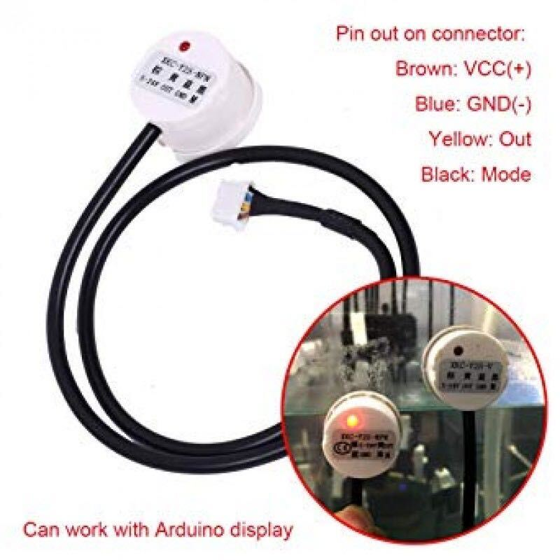

# esp32-water-sensor
Code for esp32 device that detects water pressence 

## First boot

On first boot the device will appear as a access point named `DehumidifierAP`

You will connect to that access point and fill out the a form for first time set up. 

The device has 2 ways of notifcaiton. 

* Discord web hook

* Email

Only one configuration is supported at a time. 

### Email

For email you will need to configure a google app password. See [here](https://support.google.com/accounts/answer/185833?hl=en) for how to do that. 

Once you have a google app password you will need to fill out the following fields. 

* Wifi SSD
* Wifi password
* Author email
* Google app password
* Recipment Email
* Optional Second Recipient Email

Once Configrued the ESP32 will reboot with new configs. 

### Discord

Just input the discord webhook

## Reset

To set the ESP32 click the boot buttom. Refer to the diagram below.

